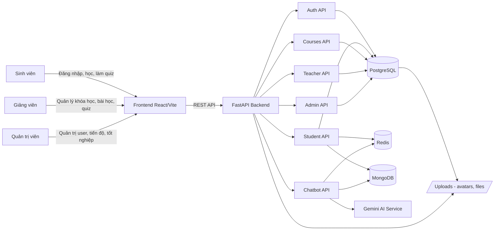
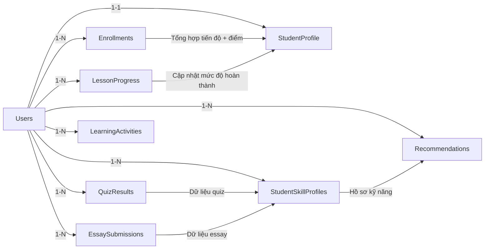

# Sơ đồ dữ liệu dự án AI Learning Platform

Tài liệu gồm 7 sơ đồ:
- Sơ đồ luồng dữ liệu (DFD)
- Sơ đồ liên kết dữ liệu (Application Data Link)
- Sơ đồ quan hệ dữ liệu (ERD)
- Sơ đồ hồ sơ sinh viên
- Sơ đồ phân cấp chức năng
- Sơ đồ xử lý dữ liệu học tập
- Sơ đồ gợi ý nội dung học tập

## 1) Sơ đồ luồng dữ liệu (DFD)

Ghi chú: `1-1` là một-một, `1-N` là một-nhiều.

## 2) Sơ đồ liên kết dữ liệu (Application Data Link)
```mermaid
flowchart TD
    P1[Landing / Auth / Student / Teacher / Admin Pages]
    P2[CertificatePage]
    P3[AdminProgressPage]

    P1 --> SVC[frontend/src/services/api.js]
    P2 --> SVC
    P3 --> SVC

    SVC --> CFG[frontend/src/config/api.js\n(API_URL, buildApiUrl)]
    SVC --> API[Backend FastAPI Routers]

    API --> R1[auth.py]
    API --> R2[student.py]
    API --> R3[courses.py]
    API --> R4[teacher.py]
    API --> R5[admin.py]
    API --> R6[chatbot.py]

    R1 --> MDL[SQLAlchemy Models]
    R2 --> MDL
    R3 --> MDL
    R4 --> MDL
    R5 --> MDL
    R6 --> MDL

    MDL --> DB[(PostgreSQL)]
    R2 --> RED[(Redis)]
    R6 --> RED
    R2 --> MON[(MongoDB)]
    R6 --> MON
    R6 --> GEM[Gemini]
```
Ghi chú: `1-1` là một-một, `1-N` là một-nhiều.

## 3) Sơ đồ quan hệ dữ liệu (ERD)
```mermaid
erDiagram
    USERS {
      int id PK
      string email UK
      string hashed_password
      string full_name
      enum role
      bool is_active
      datetime created_at
    }

    STUDENT_PROFILES {
      int id PK
      int user_id FK UK
      string student_id UK
      string major
      string specialization
      string class_name
      int intake_year
      string avatar
    }

    TEACHER_PROFILES {
      int id PK
      int user_id FK UK
      string teacher_id UK
      string department
      string position
    }

    COURSES {
      int id PK
      string course_code UK
      string course_name
      int teacher_id FK
      string major
      string specialization
      int credit_hours
      enum level
      bool is_active
    }

    LESSONS {
      int id PK
      int course_id FK
      string title
      int order
    }

    ENROLLMENTS {
      int id PK
      int student_id FK
      int course_id FK
      enum status
      int progress
      float total_score
    }

    LESSON_PROGRESS {
      int id PK
      int student_id FK
      int lesson_id FK
      bool is_completed
    }

    ASSESSMENTS {
      int id PK
      int course_id FK
      string title
      enum assessment_type
    }

    QUESTIONS {
      int id PK
      int assessment_id FK
      text question_text
    }

    SUBMISSIONS {
      int id PK
      int assessment_id FK
      int student_id FK
      float score
    }

    QUIZ_RESULTS {
      int id PK
      int user_id FK
      int lesson_id FK
      float score
    }

    ESSAY_SUBMISSIONS {
      int id PK
      int lesson_id FK
      int student_id FK
      int course_id FK
      float score
    }

    RECOMMENDATIONS {
      int id PK
      int student_id FK
      string recommendation_type
      float confidence_score
    }

    STUDENT_SKILL_PROFILES {
      int id PK
      int student_id FK
      string skill_id
      float confidence
    }

    USERS ||--o| STUDENT_PROFILES : "has"
    USERS ||--o| TEACHER_PROFILES : "has"
    USERS ||--o{ COURSES : "teaches"
    USERS ||--o{ ENROLLMENTS : "enrolls"
    USERS ||--o{ LESSON_PROGRESS : "tracks"
    USERS ||--o{ SUBMISSIONS : "submits"
    USERS ||--o{ QUIZ_RESULTS : "gets"
    USERS ||--o{ ESSAY_SUBMISSIONS : "writes"
    USERS ||--o{ RECOMMENDATIONS : "receives"
    USERS ||--o{ STUDENT_SKILL_PROFILES : "has"

    COURSES ||--o{ LESSONS : "contains"
    COURSES ||--o{ ENROLLMENTS : "is_enrolled_by"
    COURSES ||--o{ ASSESSMENTS : "has"

    LESSONS ||--o{ LESSON_PROGRESS : "progress_of"
    LESSONS ||--o{ QUIZ_RESULTS : "quiz_of"
    LESSONS ||--o{ ESSAY_SUBMISSIONS : "essay_of"

    ASSESSMENTS ||--o{ QUESTIONS : "has"
    ASSESSMENTS ||--o{ SUBMISSIONS : "receives"
```
Ghi chú: `1-1` là một-một, `1-N` là một-nhiều.

## 4) Sơ đồ hồ sơ sinh viên

Ghi chú: `1-1` là một-một, `1-N` là một-nhiều.

## 5) Sơ đồ phân cấp chức năng

```mermaid
flowchart TD
    ROOT[AI Learning Platform]

    ROOT --> F1[1. Quản lý người dùng]
    ROOT --> F2[2. Dạy và học]
    ROOT --> F3[3. Đánh giá]
    ROOT --> F4[4. Theo dõi tiến độ]
    ROOT --> F5[5. Trợ lý AI và gợi ý]
    ROOT --> F6[6. Quản trị hệ thống]

    F1 --> F11[1.1 Đăng ký / Đăng nhập]
    F1 --> F12[1.2 Hồ sơ sinh viên / giảng viên]
    F1 --> F13[1.3 Phân quyền]

    F2 --> F21[2.1 Quản lý khóa học]
    F2 --> F22[2.2 Quản lý bài học]
    F2 --> F23[2.3 Ghi danh]

    F3 --> F31[3.1 Quiz]
    F3 --> F32[3.2 Essay]
    F3 --> F33[3.3 Chấm điểm và phản hồi]

    F4 --> F41[4.1 Lesson progress]
    F4 --> F42[4.2 Course completion]
    F4 --> F43[4.3 Certificate]

    F5 --> F51[5.1 Chatbot hỏi đáp]
    F5 --> F52[5.2 Phân tích kỹ năng]
    F5 --> F53[5.3 Gợi ý nội dung]

    F6 --> F61[6.1 Dashboard admin]
    F6 --> F62[6.2 Quản lý dữ liệu]
    F6 --> F63[6.3 Kiểm tra chất lượng]
```

Ghi chú: `1-1` là một-một, `1-N` là một-nhiều.

## 6) Sơ đồ xử lý dữ liệu học tập
```mermaid
flowchart LR
    A[Sự kiện học tập\n(view lesson, làm quiz, nộp essay)] --> B[Frontend event payload]
    B --> C[FastAPI endpoint]
    C --> D[Validation và auth]
    D --> E[Ghi transactional data\nPostgreSQL]
    D --> F[Ghi realtime state\nRedis]
    D --> G[Ghi hành vi học tập\nMongoDB]

    E --> H[Aggregator job]
    F --> H
    G --> H

    H --> I[Cập nhật progress và score]
    I --> J[Student profile snapshot]
    J --> K[Recommendation engine]
    K --> L[Recommendations table]
    L --> M[Frontend hiển thị gợi ý]
```
Ghi chú: `1-1` là một-một, `1-N` là một-nhiều.

## 7) Sơ đồ gợi ý nội dung học tập
```mermaid
flowchart TD
    IN1[Học viên: major, specialization, mục tiêu]
    IN2[Lịch sử học: enrollments, progress, điểm]
    IN3[Hành vi: thời gian học, tần suất, chủ đề quan tâm]
    IN4[Nội dung: metadata bài học, độ khó, skill tags]

    IN1 --> FEA[Feature Builder]
    IN2 --> FEA
    IN3 --> FEA
    IN4 --> FEA

    FEA --> R1[Rule-based filter\n(prerequisite, mức độ)]
    FEA --> R2[Skill-gap scoring]
    FEA --> R3[Popularity và engagement prior]

    R1 --> RANK[Ranking và merge]
    R2 --> RANK
    R3 --> RANK

    RANK --> OUT[Top-N gợi ý]
    OUT --> FE[Student dashboard]
    FE --> FB[Feedback click/complete/skip]
    FB --> LOOP[Cập nhật lại mô hình gợi ý]
    LOOP --> FEA
```
Ghi chú: `1-1` là một-một, `1-N` là một-nhiều.
